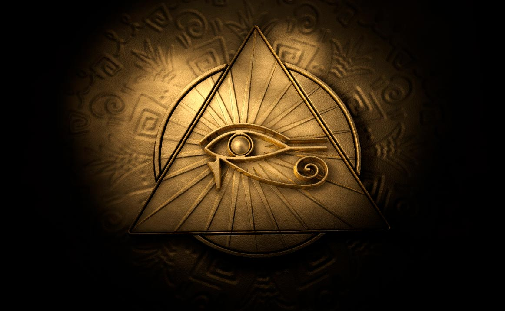
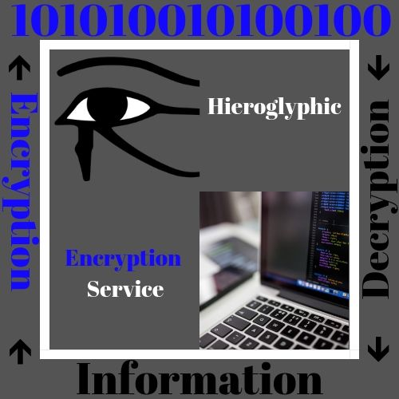

# Introduction 
In today’s world, the threat of hackers and information security has begun to become more and more of an issue. Everyday people’s personal information is stolen. Encryption and cyber security have become a way to fight against these hackers. As it turns out the most effective way to keep information stolen from hackers is to keep your documents or papers in physical form. But another way that hackers cannot steal your information, is if the information they steal is non-readable. Back in earlier societies images meant certain words of phrases, they had meaning. These images can be a way of encrypting information. For this assignment I initially wanted to use hieroglyphics as a way for of encryption, but from outside sources this was determined to be flawed. In this website and assignment, I plan to explain a single hieroglyphic and its ability to be used today for an encryption company’s logo. This specific logo is the Eye of Horus. 

# Why the Eye of Horus and Hieroglyphs? 
The reason that I chose to research and implement the Eye of Horus into my project and logo is that the eye is one of the most popular symbols of hieroglyphics. “Known also as the Wadjet, this magical symbol is believed to provide protection, health, and rejuvenation.”  The key point behind encryption is to protect people or company’s data from being stolen or used for other purposes. Not only does the eye mean protection, but hieroglyphics themselves encrypt their meaning. Unless you know how to read hieroglyphics there is no way to read them. The civilization ended many years before people were able to spread their meaning around the world. Only recently have people began to widely understand them. What is nice about these hieroglyphs is that computer programs would not be able to use their algorithms on them. Since they are not actual words, the computer programs would not pick them up. This adds another level of security; computer programs can’t read them, and neither can people. The information is very secure when encrypted with hieroglyphs. Of course, eventually hackers would be able to get around this issue, by creating new software. Using hieroglyphs as an encryption themselves would not be affective for an extended period, but the symbolism behind hieroglyphs still gives the idea or thought of unknown and secret. Which is the way that encryption companies want to keep their customers data.

# Historical Context
The creation and implementation of the hieroglyph was by the ancient Egyptians. The language was composed of logograms which represent words, phonograms representing sound, and determinatives which are located at the end of the word to clarify meaning.  History believes that these drawing originated from hunting civilizations in the desert of the west Nile. But they also believe the god Thoth created the writing to make the Egyptians able to retain their knowledge and culture over time. “Thus, the word hieroglyph comes from the Greek hiero ‘holy’ and the glypho ‘writing’. In the ancient Egyptian language, hieroglyphs were called medu netjer, the gods ‘words’ as it was believed that writing was an invention of the gods.”   The Egyptians are famous for their pottery and burial rituals, these objects often had hieroglyphs on them to tell their story. In its early existence often, these hieroglyphs were carved on rectangular wood or ivory for jewelry. They were are also put on stone, metal, and ceramic for their burial rituals. The most common reason people know about hieroglyphs is that they are on or inside the pyramids located in Egypt. 

# The Adaptation
I feel that my adaption of the Eye of Horus to a business logo for an encryption company is an example of transposition “Shifting the original to a new genre, culture, geography, time.” The Eye of Horus in ancient Egyptian times was often used as a symbol for protection. Encryption itself is protection, it protects your information. Although the symbol itself is more than likely not use in the actual programming. This is a clear change in the genre of which this symbol is use. This symbol was used in Egypt; for it to be used in programming here in the United States off America this is also shows a change in both geography and time. The ancient Egyptians made this symbol before the United States was even created. Originally for this assignment I wanted to incorporate hieroglyphics into the programming themselves, but since these are drawings not an actual alphabet. So that it would be harder for hackers to obtain and understand information. Which could be used, but eventually a hacker would be able to design a software to read these images. Making the result no different than a normal encryption. So that is why I chose to do a symbolic use of the Eye of Horus. A company that can protect its users, the same as the Egyptian used this image. If I had more time or better editing skills I would have fused both the computer and the Eye of Horus into one image with the log being on a website on the screen of the computer making the image seem more professional than just floating by itself. This would also allow the image itself to be bigger. I would have also made the “1010001010 etc” be in the background throughout the entire screen to make it seem that the company is engulfed in code and make the company seem like it can provide more protection. Instead I used a base template for a logo on Canva and I was not very proficient, and this is what my product came out to be. But I still feel that you get a lot of information from this logo with very minimal text.

### Formal Qualities
When I designed this logo, I wanted to make it so that anyone that looks at it would have an idea of how encryption works and what the services are. Not everyone is computer savvy, so images and links help people to understand what is being told or asked. In the original image of the Eye of Horus it has a black background that bring the attention to the eye itself which is centered on the image. This exhibits multiple formal qualities such as focus, shadow, framing, depth of field and lighting. This is very different from my own adaptation. In my adaption there is also a framing but mine is white which is the inverted version. I did this to represent that although this image is used in old times, we can use it in new ways. Often the color white is symbolic of new. In the original image all the focus is drawn to the eye, in my adaptation I wanted it to be bigger and encompass the entire space. This was important to me because I wanted people to see the bigger picture of the Eye of Horus use. My adaptation is not as focused, but where it lacks in focus it is beneficial in information. Outside of my white square border, there is a step by step process which shows how encryption works and what the benefit of using it entails. The numbers at the top of the logo “10010101 etc” are meant to represent encryption, additionally in this regard I changed the color of each works that related to encryption to a dark blue. The reason I did this is that “Dark Blue: Symbolizes integrity, knowledge, power, and seriousness.”. All these traits are similar between the eye of Horus and encryption. Encryption is a source of knowledge and seriousness, as is the Eye of Horus as a symbol of protection. Although these two images are very different in design and have different themes, they share the same values and perspective. They both have very important roles in the area that they are used. Encryption = protection, Eye of Horus = protection, thus encryption = Eye of Horus. 

### Cultural Meaning
When analyzing my adaption, I tend to think of Barthes and Barthes Theory. Which seems to primarily talk about semiotics “Semiotics is the study of the way signs behave within society.”. This theory is based off two topics which included language/speech and image/concept. As well as structuralism “Structuralism uses language as a model for the study of other human symbolic systems.” Essentially these two concepts discuss how language and symbols are used to represent one another. As well as discuss the meaning behind both concepts. How this related to my adaption and the original image is that de to the large time gap between ancient Egyptians and current day, the language is mostly lost, and the only content remaining is the symbols. With use of our language we try to justify symbols meaning, which we seem to have accomplished. We will never know completely how the ancient Egyptians felt about the Eye of Horus, but we can make determinations from what we understand the meaning of these images to be. Based on what we understand, this symbol is a sign for protection. To honor this image and to keep the symbolic meaning; using this symbol as a sign of protection for current day technology would keep the image in high regard. I feel that the ancient Egyptians would appreciate and support the use of this symbol for protection. Keeping the tradition and meaning behind this image. But obviously this is a religious symbol in a way, so in that regard they may not support it, but based on the information we collected it seems proper to use in this circumstance.

# Rhetorical Significance
This logo for an Encryption company is meant to target anyone that needs protection. At least in the world of cyber information. The advertisement is not complex and filled with unnecessary images, the advertisement is straight to the point and even gives an overview of how encryption works. The use of the Eye of Horus and the image of the computer next to each other create a sense of new and old. Making the viewer feel a sense that this service has history behind it and is reliable. This advertisement is having an affect like what Debord was writing about. “What we feel, what we believe, how we express desire, what we believe is possible — all are filtered through, and constrained by, the media we consume and produce.”. Due to the unknown, we often put much of our trust into companies that we do not even know are good. We only make assumptions based from what we see. So, if we see a nice advertisement, nice person, or big fancy building. We tend to think of these people or organizations as reliable. In the case of this adaption, it is not a fancy advertisement and you do not see anything else about the company. The media and advertising are directly controlling how we think and what we think is good and bad. If I had more time and skill I would have been able to make a really fancy add and now every person would think I am reliable even though I may not be. This logo I created will convince someone to consider using encryption to protect their information. People do not know how it works and are usually too lazy to figure it out themselves, so they would rather pay someone to do it.

# Reflection
1. If someone outside this class (like your intended audience) viewed your artifact, what might they think of you (the artist). Avoid answers like, "I'm a good student!" and instead, think about how your art object reflects your character. 
Honestly if I were to see my adaption online I would not even look twice at it. Anyone could have made it, there is no fancy images or interactive elements. It is very plain and boring. But based on my skill level it has a lot of symbolism and has logic behind the images and text. I am a technical minded person, I like to build things with my hands. I feel that this topic relates to me because it focuses on a service that is offered, which is what encryption is. I tried hard on this assignment, I am very busy as of lately. But I am aware that this may not look very pretty. I did the best I could.

2. If you had abundant time and resources, what would you do differently for your adaptation? 
If I had a large amount of time and resources I would change my adaption completely. It would not look the same at all. My entire logo would be one image with separate images fused into it but looking like it was just one picture. It would be much more appealing on the eyes and people would want to look at the image just to see what exactly is going on. 

3. In what situation outside of class/school might this project might be applicable and how so? 
The way in which I think that this situation may present itself outside this project is that now when I look at advertisements I will take the time to realize all the symbolism that are often included in them that people don’t notice. Additionally, I will see all the formal qualities that are present. It gives me a new appreciation for advertisements and business logos. Also, if I worked in a marketing company or position I may be make advertisement or persuasive documents. This will help me in creating them.

# Work Cited
1.Dhwty. “Eye of Horus: The True Meaning of an Ancient, Powerful Symbol.” Ancient Origins, Ancient Origins, 18 Nov. 2018, www.ancient-origins.net/artifacts-other-artifacts/eye-horus-0011014.
2.Scoville, Priscila. “Egyptian Hieroglyphs.” Ancient History Encyclopedia, Ancient History Encyclopedia, 29 May 2019, www.ancient.eu/Egyptian_Hieroglyphs/.
3.“Design Anything.” Amazingly Simple Graphic Design Software – Canva, www.canva.com/.
4.“File:Eye of Horus Bw.svg.” File:Eye of Horus Bw.svg - Wikimedia Commons, commons.wikimedia.org/wiki/File:Eye_of_Horus_bw.svg.
5.“Eval(ez_write_tag([[728,90],'incredibleart_org-Box-2','ezslot_5',113,'0']));Color Symbolism and Culture.” Symbolism of Color: Using Color for Meaning, www.incredibleart.org/lessons/middle/color2.htm.
6.B, Hara. “Julie Sanders - What Is Adaptation?” Julie Sanders - What Is Adaptation?, 1 Jan. 1970, globalshakespearesbu.blogspot.com/2014/11/julie-sanders-what-is-adaptation.html.
7.“Theoretical Context for Barthes’s Theories of the Text.” Introduction :: Theoretical Context, www.arts.uwaterloo.ca/~raha/700_701_web/BarthesLO/theory.html.
8.“Society of the Spectacle.” Beautiful Trouble, beautifultrouble.org/theory/society-of-the-spectacle/.

